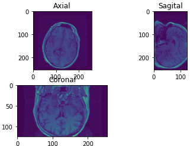
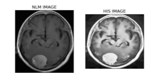
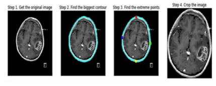
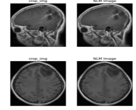

# Medical Image Processing Notebooks

This repository contains a collection of Jupyter notebooks for hands-on learning and experimentation with medical image processing. The exercises cover fundamental tasks such as DICOM handling, image correction, manipulation, and segmentation.

## Notebooks

- **DICOM.ipynb**  
  Introduction to medical imaging, including reading, saving, modifying, and displaying DICOM data. Covers essential libraries such as `numpy`, `opencv`, `pydicom`, `matplotlib`, `ipywidgets`, `dicom2nifti`, and `nibabel`.

  

- **correction.ipynb**  
  Techniques for correcting intensity bias, normalization, and filtering in medical images. Includes practical exercises and requires `SimpleITK` for advanced image processing.

  

- **manioulation.ipynb**  
  Simple image manipulation exercises, such as reading and displaying images using OpenCV.

  

- **segmentation.ipynb**  
  Brain MRI segmentation into regions of interest: background, cerebrospinal fluid, gray matter, and white matter.

